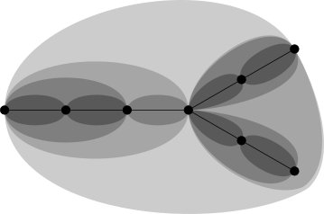
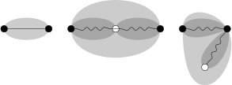

**Top Tree Library**
implements so called Top Tree data structure,
which maintains an undirected acyclic graph
together with other information (user data) on paths or in individual trees.
Main operations incl. edge insertion and removal and user data manipulation are provided in logarithmic time.

Currently, you can choose from two internal implementations,
either based on contractions [Wer06] or on biased trees [Ond18].
The self-adjusting implementation [TW05] is not available yet.

It is a very general data structure and the variety of possible user data to be stored within trees is wide.
Some log-time applications include

* aggregating weights of edges (sum, min, etc.) on paths or in trees,
* propagating changes back to all edges on path or in tree (e.g. increment their weights),
* searching for an edge with some property (e.g. minimal weight) on path or in tree,
* doing all the previous based on vertices instead of edges (though not so easily),
* working with properties of edges or vertices in context of the whole tree (so called non-local properties), e.g. searching for tree diameter or median.

You can build more complex data structures on Top Trees
such as for 2-connectivity maintenance and other general-graph problems.


Copyright © 2022  Lukáš Ondráček <<ondracek.lukas@gmail.com>>, use under MIT license.


Basic theory
============

We use the same Top Tree definition as Renato Werneck [Wer06],
instead of the original by Alstrup et al. [AHLT05].



The stored undirected tree is hierarchically partitioned into so called *clusters*.
Each cluster is a generalized edge – it represents a connected subtree with two vertices marked as *boundary*;
only these two vertices may be shared with neighbouring clusters.

The bottommost clusters in the hierarchy represent individual edges,
other clusters are formed by two neighbouring subclusters.
These two subclusters have one *shared* boundary vertex and other two distinct boundary vertices,
the boundary of the parent cluster may contain any two of these three vertices.
The topmost cluster represent the whole tree and also the path between its boundary vertices.

We distinguish three types of clusters:

* *base* cluster is just an edge,
* *compress* cluster has the unshared subclusters' endpoints as boundary,
* *rake* cluster has the same boundary as one of its subclusters.



Each cluster may have some *user data* stored in it.
The data may either be related to the whole cluster subtree or only to the path between the boundary vertices.
We usually either compute the data from the data in subclusters, thus aggregating the data from the whole subtree/subpath,
or lazily propagate some changes to subclusters when needed.
If paths are concerned,
it matters whether the cluster is compress, and so both subclusters' data are being aggregated,
or whether the cluster is rake, and so only one subcluster's data should be copied to the parent cluster.

Being able to choose which vertices should be in boundary of the whole tree,
we can find/modify the data about any path (incl. individual edges) directly in that topmost cluster.
Indeed, we always access only topmost cluster data.


Informal interface description
------------------------------

`TopTree` is an abstract templated class.

It provides the following main operations:

* *link* two vertices of different trees by an edge,
* *cut* existing edge between two vertices,
* *expose* two vertices of the same tree to make them topmost cluster's boundary,
* *search* in the tree exposing the found edge,
* access the data in the topmost cluster of an exposed tree.

It needs to be derived by a *driver*
deciding which clusters should be *joined* to form a larger cluster,
or *split* back to subclusters, when clusterization should be changed.
Available such specializations are `ContractionTopTree` and `BiasedTreeTopTree`.

It takes a class (or multiple) storing user data in each cluster as template argument(s).
Besides the data members the class should implement two static methods:

* *join* computing cluster data from its subclusters when the cluster is being created, and
* *split* propagating changes to subclusters when their parent is being destroyed.

Each time join/split is being called, the parent cluster is the topmost one;
all its ancestors have either been split or not yet joined.
This guarantee allows proper data aggregation/propagation.

In addition to access to the exposed tree data,
link method takes user data to be stored in the newly created edge
and cut method returns user data in the removed edge just before its removal
(i.e. after splitting all its ancestors).

The exact time complexities of the operations above are given by the chosen driver,
but each of them is bounded by O(log n) plus O(log n) calls of split/join,
where n is the size of the forest, at least in an amortized sense.


Non-local search operation
--------------------------

Searching is a little more complicated.
The method search takes a lambda function as an argument.
This function is always called to a cluster
and should decide in which its subcluster the wanted edge is.

As said earlier, we can access only data in the topmost cluster,
and so even our lambda function is always called on the topmost cluster.
Then the clusterization is modified moving some part of the tree from one subcluster to the other
and the function is called again.

After logarithmically many calls (based on driver) the wanted edge is found and exposed.

In fact, there are two variants of searching.
We can search either for an edge in the whole exposed tree or only on the exposed path in the tree.


Simple example code
===================

The following example code shows
how to maintain path lengths in a forest with edges of different lengths.
It needs `ContractionTopTree.hpp` to be included.

```cpp
struct MyClusterData {
	int length; // length of path between boundary vertices

	// Constructor to be used when creating an edge of given length
	MyClusterData(int length) : length(length) {}

	// Default constructor for internal use, data will be initialized by join
	MyClusterData() = default;

	// Aggregating path lengths when joining clusters
	static void join(TopTreeEventData<MyClusterData> eventData) {
		if (eventData.type == TopTreeClusterType::COMPRESS) {

			// the path goes through both subclusters
			eventData.parent.length =
				eventData.children[0].length + eventData.children[1].length;

		} else { // TopTreeClusterType::RAKE

			// the first subcluster has the same bondary vertices as its parent
			// the second subcluster is out of the path
			eventData.parent.length = eventData.children[0].length;

		}
	}

	// Propagating data back to edges is not needed
	static void split(TopTreeEventData<MyClusterData> eventData) {}
};

ContractionTopTree<MyClusterData> forest;

TopTreeVertex u = forest.newVertex();
TopTreeVertex v = forest.newVertex();
TopTreeVertex w = forest.newVertex();
TopTreeVertex z = forest.newVertex();

forest.link(u, v, MyClusterData(1)); // edge uv of length 1
forest.link(v, w, 2); // edge vw of length 2 using implicit conversion of int to MyClusterData
forest.link(v, z, 4);

forest.expose(u, w);
int uw_length = forest.getExposedData().length; // returns 3

forest.expose(w, z);
int wz_length = forest.getExposedData().length; // returns 6

forest.cut(u, v);
forest.link(u, z, 8);

forest.expose(u, w);
int new_uw_length = forest.getExposedData().length; // returns 14

```


Internal implementations (drivers)
==================================

`TopTree` is an abstract class implementing some common parts of the data structure.
There are two derived classes implementing the internal clusterization balancing:

* `ContractionTopTree` (based on [Wer06]) and
* `BiasedTreeTopTree`  (based on [Ond18]).

Both of them have the same asymptotic guarantees and also interface given by `TopTree` class,
so you can use them interchangeably.
There is an ongoing research on their experimental comparison in different situations;
currently it seems, that `ContractionTopTree` would be usually faster.

Both implementations guarantee logarithmic number of levels of the hierarchical clusterization in the size of the tree.
They also provide operations link, cut, expose, search in O(log n) worst case time
using O(log n) calls to user-defined split and join, where n is the size of involved trees.
Some of the calls to split and join may be delayed making the time guarantees only amortized,
as described in the following subsection.

There was also proposed so called self-adjusting driver in [TW05],
which is not yet implemented here.
It should be the fastest but provides only amortized guarantees,
from which other limitations follows.


Lazy aggregation and propagation
--------------------------------

User data are always aggregated and propagated as late as possible.

Operations link and cut need to destroy part of the hierarchy
and so splits are forced to be executed, but no joins.

Operation expose keeps the original hierarchy
and only temporarily creates the modified part beside it;
before next operation the temporary part is destroyed unrolling all structural changes.
No links/cuts are forced in this case.

Access to the topmost cluster data (calling `getExposedData` method) forces delayed joins in the whole tree.
If the last operation was expose, even some splits in the original tree may be forced;
following rollback then forces splits in the temporal part of the tree.
If multiple user data classes are used, only data of the needed one are propagated.

The search operation creates temporary tree similarly to expose,
but forces some splits/joins to be able to ask user which subcluster to choose.

This may save some splits/joins if you perform several links/cuts without accessing the data;
and even all of them if you perform exposes without accessing the data.
It is useful specially in the situation,
when you use multiple user data structures in one Top Tree
and you need only some of them at some time;
you can then perform exposes and some data accesses keeping unneeded data untouched.
It may be even asymptotically beneficial if splits/joins are not constant-time.

If you, on the other hand, need the worst-case time guarantees,
just call `getExposedData` after each operation on all affected trees and all user data
to force all delayed splits and joins.


API overview
============

Only the main parts of the library are described here,
see header files for the rest.

`class TopTree<class... TUserData>`, `class ContractionTopTree<class... TUserData>`, `class BiasedTreeTopTree<class... TUserData>`
----------------------------------------------------------------------------------------------------------------------------

These are variadic templates taking user data classes as arguments.
If multiple arguments are used, the lazy data propagation works independently for each of them;
this may however cause some overhead to keeping data in one class if you always need all of them.

The classes `ContractionTopTree` and `BiasedTreeTopTree` are derived from the abstract `TopTree` class.


### `TopTreeVertex newVertex()`

Creates and returns new vertex.
The time complexity is amortized constant.

Currently, vertices are just integers numbered from zero,
you can use `getVerticesCnt()` to find out their number.


### `void link(TopTreeVertex u, TopTreeVertex v, TUserData... userData)`

Creates new edge between vertices u and v,
assigning given user data to its base cluster.
The resulting tree is exposed after the operation, its boundary may be arbitrary.

The time complexity is logarithmic in the worst case for both drivers,
causing logarithmically many calls to split/join (some of them may be delayed).

The behaviour is undefined if the edge already exists or creates a cycle.


### `tuple<TUserData...> cut(TopTreeVertex u, TopTreeVertex v)`

Removes an edge between vertices u and v
returning a tuple of user data assigned to its base cluster.
One of the resulting trees is exposed after the operation unless both u and v become isolated,
in which case exposed tree is undefined.

The time complexity is logarithmic in the worst case for both drivers,
causing logarithmically many calls to split/join (some of them may be delayed).

The behaviour is undefined if the edge doesn't exist.


### `bool expose(TopTreeVertex u, TopTreeVertex v)`

Exposes path between u and v and the tree containing them
making u and v boundary vertices of its topmost cluster.
Use `getExposedData` to access the associated data.

Returns false if u and v are not in the same tree.

The time complexity is logarithmic in the worst case for both drivers,
causing logarithmically many delayed calls to split/join.


### `bool exposeTree(TopTreeVertex v)`

Exposes tree containing v, its boundary vertices may be arbitrary after this operation.
Use `getExposedData` to acces the associated data.

Returns false if v is an isolated vertex and so it is not contained in any cluster.

The time complexity is logarithmic in the worst case for both drivers;
they also guarantee that clusterization is not changed and no splits/joins are called.

### `void search<int I=0>(TSelect select)`

Searches for an edge in an exposed tree according to the `I`-th user data,
the found edge is then exposed.
It takes a lambda function of the following signature as an argument

	bool select(EventData<I-th TUserData> eventData)

The function is always called on the topmost cluster (still containing the whole tree),
and should return in which subcluster the wanted edge is,
i.e. `i=0` or `i=1` (typed as bool) s.t. `eventData.children[i]` contains the edge.

The cluster on which `select` is called is always joined just before that call,
so all possible changes from the topmost cluster are guaranteed to be propagated to its subclusters.

The time complexity excl. splits/joins is logarithmic in the worst case for both drivers,
causing logarithmically many calls to select and logarithmically many delayed calls to split/join,
but may also force execution of some delayed splits/joins of the I-th data.

If no tree is exposed nothing happens and select is not called.


### `void pathSearch<int I=0>(TSelect select)`

Searches for an edge on an exposed path according to the `I`-th user data,
the found edge is then exposed.

It works similar to search, except for the additional guarantee,
that the exposed path stays the same throughout the whole search.


### `I-th TUserData &getExposedData<int I=0>()`

Returns reference to the `I`-th user data associated with the topmost cluster of the exposed tree.
The returned object is valid until any operation involving changes in clusterization is called
and it can be also modified for this period of time.

This operation may cause execution of splits/joins delayed from calls to `link`, `cut`, `expose`, `search` and `pathSearch`;
otherwise it has constant time complexity.

The behaviour is undefined if no tree is exposed.
This may happen before the first link or after cutting the last edge in a tree.


### `pair<TopTreeVertex, TopTreeVertex> getBoundary()`

Returns the boundary vertices of an exposed tree in constant time.

The behaviour is undefined if no tree is exposed.


User data class requirements
----------------------------

Besides data members to be stored in each cluster,
user data class should contain

* (empty) default constructor,
* copy constructor,
* copy assignment operator,
* method `static void join(TopTreeEventData<TUserData> eventData)`,
* method `static void split(TopTreeEventData<TUserData> eventData)`,

where `TUserData` is the name of the user data class.

Both static methods have access to parent cluster data, its subclusters data and other information through eventData;
`join` should set parent cluster values for data members based on values in children,
while `split` may propagate changes from parent to children.

Internally, data structure is first initialized by its default constructor and then used repeatedly.
All data members therefore should be set in both copy assignment operator (for base clusters)
and join method (for rake and compress clusters).


`struct EventData<class TUserData>`
-----------------------------------

The `EventData` structure is used as an argument of `split`, `join`, and `select` (for searching)
providing access to user data of a cluster (parent) and its subclusters (children)
and other information about that clusters, specifically:

### `TUserData parent`

Reference to the parent user data.

### `TUserData children[2]`

References to children user data.

### `TopTreeVertex boundary[2]`

Boundary vertices of the parent cluster.
It is guaranteed that `children[i]` has `boundary[i]` in its boundary.

### `TopTreeVertex innerVertex`

The vertex which is in boundary of at least one children but not in parent boundary.

### `TopTreeClusterType type`

Type of the cluster, which may be either `TopTreeClusterType::COMPRESS` or `TopTreeClusterType::RAKE`.

If the type is `COMPRESS`,
`innerVertex` is the shared vertex of children clusters
and the path between `boundary` vertices passes through both children.

If the type is `RAKE`,
`children[0]` has the same boundary as parent
and `children[1]` has `boundary[1]` and `innerVertex` as its boundary.
The path between `boundary` vertices thus passes only through `children[0]`;
`children[1]` shares only one vertex with it.


### `TopTreeVertex childrenBoundary[2][2]`

Boundary vertices of children are uniquely given by the previous data members, but their order may be different.

The array `childrenBoundary[i]` contains boundary of `children[i]` in the same order
as `boundary` would use in EventData of `children[i]`.


Example code – propagating changes and searching
================================================

In the following code, we maintain tree with weights on edges.
We want to be able in logarithmic time to

* compute minimal weight on a given path,
* increase all weights on a given path by a given number,
* find edge with minimal weight on a given path.

It needs `ContractionTopTree.hpp` to be included.

```cpp
struct MyClusterData {
	int minWeight; // minimal weight on path (or weight of an edge)

	MyClusterData(int weight) : minWeight(weight) {}
	MyClusterData() = default;

	// Increase weights of all edges on the path (to be propagated later)
	void incWeightsOnPath(int delta) {
		minWeight += delta;
	}

	// Aggregate minimal weight of an edge in the cluster
	static void join(TopTreeEventData<MyClusterData> eventData) {
		if (eventData.type == TopTreeClusterType::COMPRESS) {

			eventData.parent.minWeight =
				std::min(eventData.children[0].minWeight,
					eventData.children[1].minWeight);

		} else { // TopTreeClusterType::RAKE

			eventData.parent.minWeight = eventData.children[0].minWeight;

		}
	}

	// Compute how minWeight was changed and propagate the change to subclusters
	static void split(TopTreeEventData<MyClusterData> eventData) {
		if (eventData.type == TopTreeClusterType::COMPRESS) {

			int delta =
				eventData.parent.minWeight -
				std::min(eventData.children[0].minWeight,
					eventData.children[1].minWeight);
			eventData.children[0].minWeight += delta;
			eventData.children[1].minWeight += delta;

		} else { // TopTreeClusterType::RAKE

			int delta = eventData.parent.minWeight - eventData.children[0].minWeight;
			eventData.children[0].minWeight += delta;

		}
	}

};

ContractionTopTree<MyClusterData> forest;

// create four vertices
TopTreeVertex u = forest.newVertex();
TopTreeVertex v = forest.newVertex();
TopTreeVertex w = forest.newVertex();
TopTreeVertex z = forest.newVertex();

// create edges of given weights
forest.link(u, v, 1);
forest.link(v, w, 3);
forest.link(v, z, 5);

// get minimal weight on path uw and increse all weights on that path by 3
forest.expose(u, w);
int uw_minWeight = forest.getExposedData().minWeight; // returns 1
forest.getExposedData().incWeightsOnPath(3); // increases weight of uv to 4 and weight of vw to 6

// find minimal-weight edge on path wz and get its vertices and weight
forest.expose(w, z);
forest.pathSearch([](auto eventData) {
		// return i if children[i] contains minimum
		return eventData.children[0].minWeight > eventData.children[1].minWeight;
});
auto [v1, v2] = forest.getBoundary(); // returns {v, z} or {z, v}
int v1v2_weight = forest.getExposedData().minWeight; // returns 5

// cut edge uv and get its final weight
auto [uv_data] = forest.cut(u, v);
int uv_final_weight = uv_data.minWeight; // returns 4
```


References
==========

[AHLT05] Stephen Alstrup, Jacob Holm, Kristian De Lichtenberg, and Mikkel Thorup. Maintaining information in fully dynamic trees with top trees. ACM Trans. Algorithms, 1(2):243–264, October 2005.

[Wer06] Renato F. Werneck. Design and Analysis of Data Structures for Dynamic Trees. PhD thesis, Princeton University, Princeton, NJ, USA, 2006.

[TW05] Robert E. Tarjan and Renato F. Werneck. Self-adjusting top trees. In Proceedings of the Sixteenth Annual ACM-SIAM Symposium on Discrete Algorithms, SODA ’05, pages 813–822, Philadelphia, PA, USA, 2005. Society for Industrial and Applied Mathematics.

[Ond18] Lukáš Ondráček. Worst case driver for top trees. Master’s thesis, Faculty of Mathematics and Physics, Charles University, 2018.
